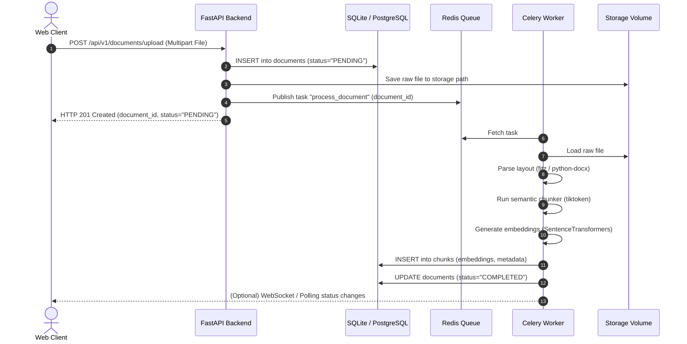
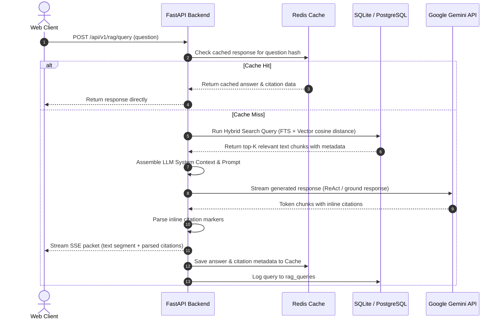
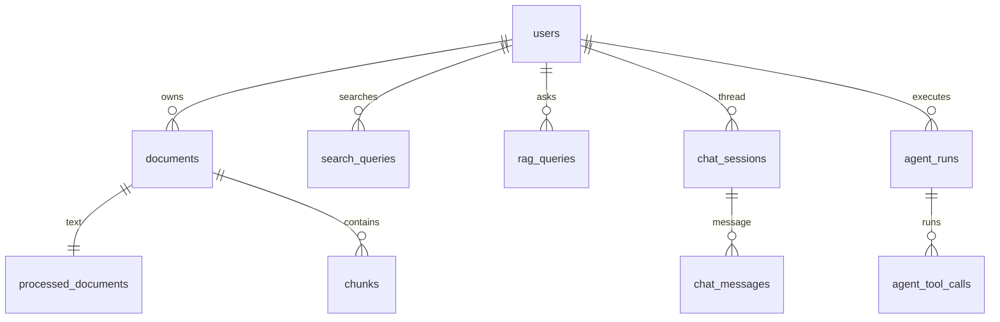

# Developer Portfolio Guide: Enterprise RAG AI Assistant

This guide is curated for developers, engineers, and hiring managers. It walks through the core implementation details, architectural sequences, and source code pathways of the **Enterprise RAG AI Assistant**.

---

## 1. Architectural Workflows & Sequences

### Document Ingestion Sequence

The following diagram illustrates the sequence of asynchronous events triggered when a user uploads a document:

---

## 2. Conversational RAG Query Sequence

This diagram shows how a user's question is resolved using the hybrid retrieval and streamed response pipeline:

---

## 3. Database Schema Blueprint

### Table Definitions

#### 1. `users`
* `id` (UUID, PK)
* `email` (VARCHAR, Unique, Index)
* `hashed_password` (VARCHAR)
* `full_name` (VARCHAR)
* `role` (VARCHAR: admin, user)
* `is_active` (BOOLEAN)

#### 2. `documents`
* `id` (UUID, PK)
* `user_id` (UUID, FK → `users.id`)
* `original_filename` (VARCHAR)
* `stored_filename` (VARCHAR)
* `mime_type` (VARCHAR)
* `file_size` (INTEGER)
* `sha256_hash` (VARCHAR)
* `storage_path` (VARCHAR)
* `processing_status` (VARCHAR: PENDING, PROCESSING, COMPLETED, FAILED)

#### 3. `processed_documents`
* `id` (UUID, PK)
* `document_id` (UUID, FK → `documents.id`, Unique)
* `raw_text` (TEXT)
* `clean_text` (TEXT)
* `language` (VARCHAR)
* `page_count` (INTEGER)
* `word_count` (INTEGER)
* `character_count` (INTEGER)
* `processing_time` (FLOAT)

#### 4. `chunks`
* `id` (UUID, PK)
* `document_id` (UUID, FK → `documents.id`)
* `chunk_index` (INTEGER)
* `text` (TEXT)
* `token_count` (INTEGER)
* `embedding` (VECTOR 768)
* `page_number` (INTEGER)
* `metadata` (JSON)

---

## 4. Source Code Blueprint

Here are the key modules implementing our design patterns:

### Core Configurations
* [settings.py](file:///d:/Enterprise%20RAG%20AI%20Assistant/backend/app/config/settings.py): Single source of truth settings parser using `pydantic-settings`.
* [database.py](file:///d:/Enterprise%20RAG%20AI%20Assistant/backend/app/db/session.py): SQLAlchemy async session factory and engine setups.

### Document Processing Services
* [fitz_processor.py](file:///d:/Enterprise%20RAG%20AI%20Assistant/backend/app/processors/pdf_processor.py): Layout-aware PDF text parsing.
* [chunker.py](file:///d:/Enterprise%20RAG%20AI%20Assistant/backend/app/services/chunking_service.py): Semantic recursive tiktoken splitting.
* [embedder.py](file:///d:/Enterprise%20RAG%20AI%20Assistant/backend/app/services/embedding_service.py): Batch embedding execution using SentenceTransformers.

### Retrieval & Generation
* [retrieval.py](file:///d:/Enterprise%20RAG%20AI%20Assistant/backend/app/services/retrieval_service.py): Hybrid search with Reciprocal Rank Fusion.
* [rag_query.py](file:///d:/Enterprise%20RAG%20AI%20Assistant/backend/app/api/v1/endpoints/rag.py): Grounded RAG answering with SSE streams.
* [agent_service.py](file:///d:/Enterprise%20RAG%20AI%20Assistant/backend/app/agents/agent_service.py): ReAct tool-calling loop runtime and constraints.
