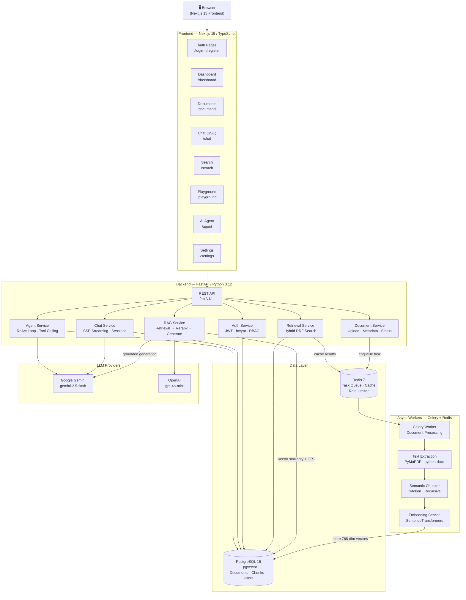

<div align="center">

# 🧠 Enterprise RAG AI Assistant

**A production-ready Retrieval-Augmented Generation (RAG) platform for enterprise document intelligence.**

Built with FastAPI · Next.js 15 · PostgreSQL/pgvector · Celery · Redis · Docker

[](https://www.python.org/)
[](https://fastapi.tiangolo.com/)
[](https://nextjs.org/)
[](https://www.typescriptlang.org/)
[](https://github.com/pgvector/pgvector)
[](https://redis.io/)
[](https://docs.docker.com/compose/)
[](LICENSE)
[](backend/tests/)

</div>

---

## 📋 Table of Contents

- [Overview](#-overview)
- [Key Features](#-key-features)
- [System Architecture](#-system-architecture)
- [Technology Stack](#-technology-stack)
- [Screenshots](#-screenshots)
- [Quick Start](#-quick-start)
  - [Prerequisites](#prerequisites)
  - [Local Development](#local-development-without-docker)
  - [Docker Setup](#docker-setup-recommended)
- [Environment Variables](#-environment-variables)
- [API Overview](#-api-overview)
- [Folder Structure](#-folder-structure)
- [Running Tests](#-running-tests)
- [Deployment Guide](#-deployment-guide)
- [Future Improvements](#-future-improvements)
- [License](#-license)

---

## 🌐 Overview

The **Enterprise RAG AI Assistant** is a full-stack, production-certified AI platform that enables organizations to query their private document repositories using natural language.

Users can:
1. **Upload documents** (PDF, DOCX, TXT) to a persistent knowledge base.
2. **Ask natural language questions** grounded in their private documents.
3. **Receive cited, structured answers** powered by Google Gemini or OpenAI.
4. **Explore search results** through hybrid semantic + keyword search with scoring.
5. **Run autonomous AI agents** using a ReAct reasoning loop with tool invocation.
6. **Stream conversational responses** with session persistence and inline citations.

This project showcases end-to-end GenAI engineering: async ingestion pipelines, vector embeddings, hybrid retrieval, LLM orchestration, and a modern React UI.

---

## ✨ Key Features

| Category | Features |
|---|---|
| **Document Ingestion** | PDF (PyMuPDF), DOCX (python-docx), TXT — async via Celery + Redis |
| **Intelligent Chunking** | Recursive semantic chunker using tiktoken — preserves sentence boundaries |
| **Vector Embeddings** | SentenceTransformers (`BAAI/bge-base-en-v1.5`) → 768-dim pgvector storage |
| **Hybrid Search** | Semantic cosine similarity + FTS keyword search fused via Reciprocal Rank Fusion (RRF) |
| **RAG Pipeline** | Retrieved context → Reranked → Grounded LLM response with `[1]` citations |
| **Streaming Chat** | Server-Sent Events (SSE) with session memory, markdown, and live citation parsing |
| **ReAct AI Agent** | Tool-calling loop with knowledge_search, document_lookup, and summarize tools |
| **LLM Providers** | Google Gemini, OpenAI — pluggable provider abstraction layer |
| **Authentication** | JWT access + refresh tokens, bcrypt hashing, RBAC, token rotation |
| **Rate Limiting** | Redis sliding-window rate limiters on auth and ingestion routes |
| **Observability** | Latency tracking, token counts, confidence scores, source attribution |
| **RAG Playground** | Interactive query console with retrieved chunk viewer and metrics |
| **Dashboard** | Workspace statistics: documents, chunks, conversations, searches |
| **Settings** | Interactive LLM configuration: temperature, top-k, max tokens, system prompt |
| **Production Ready** | Multi-stage Docker builds, non-root containers, health checks, JSON logging |

---

## 🏗 System Architecture



---

## 🛠 Technology Stack

| Layer | Technology | Purpose |
|---|---|---|
| **Frontend** | Next.js 15, TypeScript, React | SPA with SSR/SSG support |
| **Styling** | Tailwind CSS, CSS Modules | Utility-first responsive design |
| **Backend** | FastAPI, Python 3.12, Uvicorn | Async REST API server |
| **Auth** | python-jose, bcrypt, JWT | Stateless token authentication |
| **Database** | PostgreSQL 16, SQLAlchemy 2.0, asyncpg | Async ORM with typed queries |
| **Vector Store** | pgvector | Native vector extension for PostgreSQL |
| **Embeddings** | SentenceTransformers (BAAI/bge-base-en-v1.5) | 768-dim dense vector generation |
| **Task Queue** | Celery 5, Redis 7 | Async background document processing |
| **LLM** | Google Gemini API, OpenAI API | Text generation with citation grounding |
| **Migrations** | Alembic | Schema version control |
| **PDF Parsing** | PyMuPDF (fitz), python-docx | Layout-aware text extraction |
| **Chunking** | tiktoken | Token-accurate recursive sentence chunking |
| **Caching** | Redis | Semantic search result caching |
| **Rate Limiting** | Redis sliding window | Auth & ingestion rate protection |
| **Streaming** | Server-Sent Events (SSE) | Real-time streamed chat completions |
| **Testing** | pytest, pytest-asyncio, httpx | 172 async API tests |
| **Containerization** | Docker, Docker Compose | Multi-stage production builds |
| **Code Quality** | Ruff, Mypy, Pre-commit | Lint, type check, format enforcement |

---

## 📸 Screenshots

> The application features a modern dark-themed UI with glassmorphism effects, gradient accents, and responsive layouts.

| Module | Description |
|---|---|
| **Landing Page** | Hero CTA with feature cards and Quick Actions navigation |
| **Dashboard** | Workspace statistics — documents, chunks, conversations, searches |
| **Documents** | Upload manager with drag-and-drop, status polling, and metadata |
| **Chat** | Streaming conversation with inline citations and session history |
| **Semantic Search** | Hybrid vector+keyword search with scored result cards |
| **RAG Playground** | Interactive query console with full chunk viewer and token metrics |
| **AI Agent** | ReAct agent with step-by-step reasoning trace and tool call log |
| **Settings** | Interactive LLM configuration form with localStorage persistence |

---

## 🚀 Quick Start

### Prerequisites

| Tool | Version | Install |
|---|---|---|
| Python | 3.12+ | [python.org](https://python.org) |
| Node.js | 20 LTS | [nodejs.org](https://nodejs.org) |
| Docker Desktop | Latest | [docker.com](https://docker.com) |
| Git | 2.x | [git-scm.com](https://git-scm.com) |

### Local Development (Without Docker)

#### 1. Clone the Repository

```bash
git clone https://github.com/Hariom9951/Enterprise-RAG-AI-Assistant.git
cd Enterprise-RAG-AI-Assistant
```

#### 2. Backend Setup

```bash
cd backend

# Create and activate virtual environment
python -m venv .venv
# Windows
.venv\Scripts\activate
# macOS/Linux
source .venv/bin/activate

# Install dependencies
pip install -r requirements.txt

# Configure environment
cp .env.example .env
# Edit .env — set DATABASE_URL, SECRET_KEY, GEMINI_API_KEY
```

#### 3. Database Setup

```bash
# Run PostgreSQL with pgvector (via Docker)
docker run --name rag-postgres \
  -e POSTGRES_USER=raguser \
  -e POSTGRES_PASSWORD=ragpassword \
  -e POSTGRES_DB=ragdb \
  -p 5432:5432 -d pgvector/pgvector:pg16

# Run Redis
docker run --name rag-redis -p 6379:6379 -d redis:7-alpine

# Apply database migrations
alembic upgrade head
```

#### 4. Start the API Server

```bash
uvicorn app.main:app --reload --host 0.0.0.0 --port 8000
```

| Endpoint | URL |
|---|---|
| API Root | http://localhost:8000/api/v1/ |
| Health Check | http://localhost:8000/api/v1/health |
| Swagger UI | http://localhost:8000/docs |
| ReDoc | http://localhost:8000/redoc |

#### 5. Start Celery Worker (new terminal)

```bash
cd backend
celery -A app.tasks.celery_app worker --loglevel=info
```

#### 6. Frontend Setup (new terminal)

```bash
cd frontend
npm install
npm run dev
```

Frontend available at **http://localhost:3000**

---

### Docker Setup (Recommended)

The full stack — PostgreSQL, Redis, Backend API, Celery Worker, and Next.js — launches with a single command.

#### 1. Configure Environment

```bash
cd backend
cp .env.example .env
# Set your GEMINI_API_KEY and a strong SECRET_KEY in backend/.env
```

Generate a strong secret key:
```bash
python -c "import secrets; print(secrets.token_hex(32))"
```

#### 2. Launch All Services

```bash
# From the project root
docker compose up --build -d
```

#### 3. Apply Database Migrations

```bash
docker compose exec backend alembic upgrade head
```

#### 4. Verify Health

```bash
docker compose ps
curl http://localhost:8000/api/v1/health
```

| Service | URL |
|---|---|
| Frontend | http://localhost:3000 |
| Backend API | http://localhost:8000 |
| Swagger UI | http://localhost:8000/docs |

#### Stop Services

```bash
docker compose down
# Remove all data volumes
docker compose down -v
```

---

## 🔐 Environment Variables

Copy `backend/.env.example` to `backend/.env` and configure:

| Variable | Default | Required | Description |
|---|---|---|---|
| `DATABASE_URL` | `postgresql+asyncpg://...` | ✅ | Async PostgreSQL connection URI |
| `SECRET_KEY` | *placeholder* | ✅ | JWT signing secret — **must change in production** |
| `GEMINI_API_KEY` | *empty* | ✅ | Google AI Studio API key |
| `REDIS_URL` | `redis://localhost:6379/0` | ✅ | Redis connection URI |
| `ENVIRONMENT` | `development` | — | `development` · `staging` · `production` |
| `DEBUG` | `false` | — | Enable debug mode (never `true` in production) |
| `LLM_PROVIDER` | `gemini` | — | `gemini` · `openai` |
| `GEMINI_MODEL` | `gemini-2.5-flash` | — | Gemini model identifier |
| `OPENAI_API_KEY` | *empty* | — | OpenAI API key (if using OpenAI provider) |
| `RAG_TOP_K` | `5` | — | Number of retrieved chunks per query |
| `RAG_TEMPERATURE` | `0.2` | — | LLM generation temperature |
| `ACCESS_TOKEN_EXPIRE_MINUTES` | `30` | — | JWT access token TTL |
| `REFRESH_TOKEN_EXPIRE_DAYS` | `7` | — | JWT refresh token TTL |
| `ALLOWED_ORIGINS` | `http://localhost:3000` | — | Comma-separated CORS origins |
| `LOG_LEVEL` | `INFO` | — | `DEBUG` · `INFO` · `WARNING` · `ERROR` |
| `LOG_FORMAT` | `text` | — | `text` · `json` (use `json` in production) |

---

## 📡 API Overview

All endpoints prefixed with `/api/v1/`. Full documentation: [`API_DOCUMENTATION.md`](API_DOCUMENTATION.md)

| Method | Endpoint | Description |
|---|---|---|
| `GET` | `/health` | System health check |
| `POST` | `/auth/register` | Create new user account |
| `POST` | `/auth/login` | Authenticate → receive JWT tokens |
| `POST` | `/auth/refresh` | Rotate expired tokens |
| `GET` | `/users/me` | Authenticated user profile |
| `POST` | `/documents/upload` | Upload document (PDF/DOCX/TXT) |
| `GET` | `/documents/` | List all user documents |
| `GET` | `/documents/{id}` | Document details and status |
| `DELETE` | `/documents/{id}` | Delete document and vectors |
| `POST` | `/search` | Hybrid semantic+keyword search |
| `GET` | `/search/history` | Search audit log |
| `POST` | `/rag/query` | RAG query with grounded answer |
| `GET` | `/rag/models` | List supported LLM models |
| `GET` | `/chat/sessions` | List chat sessions |
| `POST` | `/chat/sessions` | Create new chat session |
| `POST` | `/chat/sessions/{id}/stream` | Stream SSE chat response |
| `POST` | `/agent/chat` | Run ReAct agent query |
| `GET` | `/dashboard/statistics` | Workspace aggregated stats |

---

## 📁 Folder Structure

```
Enterprise-RAG-AI-Assistant/
│
├── backend/                          # Python / FastAPI backend
│   ├── app/
│   │   ├── main.py                   # FastAPI app factory + lifespan hooks
│   │   ├── api/v1/
│   │   │   ├── router.py             # Aggregate all sub-routers
│   │   │   └── endpoints/
│   │   │       ├── auth.py           # Register, Login, Refresh
│   │   │       ├── users.py          # /users/me profile
│   │   │       ├── documents.py      # Upload, List, Delete
│   │   │       ├── search.py         # Hybrid semantic+FTS search
│   │   │       ├── rag.py            # RAG query generation
│   │   │       ├── chat.py           # SSE streaming chat sessions
│   │   │       ├── agent.py          # ReAct agent endpoint
│   │   │       ├── dashboard.py      # Workspace statistics
│   │   │       └── health.py         # Health check
│   │   ├── agents/
│   │   │   └── agent_service.py      # ReAct loop with tool calling
│   │   ├── services/
│   │   │   ├── rag_service.py        # RAG retrieval + generation
│   │   │   ├── chat_service.py       # Session management + SSE
│   │   │   ├── retrieval_service.py  # Hybrid RRF search engine
│   │   │   ├── embedding_service.py  # SentenceTransformer wrapper
│   │   │   ├── chunking_service.py   # Recursive semantic chunker
│   │   │   ├── document_service.py   # Document CRUD + storage
│   │   │   ├── llm_providers.py      # Gemini/OpenAI abstraction
│   │   │   └── auth_service.py       # JWT, bcrypt, token rotation
│   │   ├── tasks/
│   │   │   ├── celery_app.py         # Celery app configuration
│   │   │   └── document_tasks.py     # process_document async task
│   │   ├── processors/
│   │   │   └── pdf_processor.py      # PyMuPDF text extraction
│   │   ├── models/                   # SQLAlchemy ORM models
│   │   ├── schemas/                  # Pydantic request/response models
│   │   ├── config/
│   │   │   └── settings.py           # Pydantic-settings env loader
│   │   ├── core/
│   │   │   ├── security.py           # bcrypt + JWT creation
│   │   │   └── exceptions.py         # Custom exception hierarchy
│   │   ├── db/
│   │   │   └── session.py            # Async SQLAlchemy engine + DI
│   │   └── middleware/
│   │       ├── cors.py               # CORS policy
│   │       └── security.py           # CSP, X-Frame, rate limiting
│   ├── alembic/                      # Database migration scripts
│   ├── tests/                        # 172 async API tests
│   ├── scripts/                      # Benchmarks, load tests, backup
│   ├── Dockerfile                    # Multi-stage Python 3.12 build
│   ├── requirements.txt              # Pinned Python dependencies
│   └── .env.example                  # Environment variable template
│
├── frontend/                         # Next.js 15 + TypeScript
│   └── src/
│       ├── app/
│       │   ├── (auth)/               # Login + Register pages
│       │   ├── dashboard/            # Workspace statistics
│       │   ├── documents/            # Document manager
│       │   ├── chat/                 # SSE streaming chat
│       │   ├── search/               # Semantic search UI
│       │   ├── playground/           # RAG query console
│       │   ├── agent/                # AI agent workspace
│       │   ├── settings/             # Config form
│       │   ├── HomeClient.tsx        # Landing page client
│       │   └── layout.tsx            # Root layout
│       ├── components/
│       │   └── Navigation.tsx        # Glassmorphic sidebar
│       └── lib/
│           ├── api.ts                # Typed HTTP client
│           ├── auth.ts               # Token storage helpers
│           └── markdown.tsx          # Custom markdown renderer
│
├── docker-compose.yml                # Full stack orchestration
├── docs/                             # Architecture & API docs
├── scripts/                          # DevOps utility scripts
├── README.md                         # This file
├── DEPLOYMENT.md                     # Production deployment guide
├── PROJECT_STRUCTURE.md              # Detailed codebase reference
├── FEATURES.md                       # Full feature catalogue
├── API_DOCUMENTATION.md              # Request/response examples
├── INTERVIEW_GUIDE.md                # GenAI interview prep guide
└── LICENSE                           # MIT License
```

---

## 🧪 Running Tests

Tests run against an in-memory SQLite database — no external services required.

```bash
cd backend

# Activate virtual environment
.venv\Scripts\activate     # Windows
source .venv/bin/activate   # macOS/Linux

# Run the full test suite
pytest tests/ -v

# Run with coverage report
pytest tests/ --cov=app --cov-report=term-missing
```

**Test Results:** 172 tests — 100% pass rate across auth, documents, chunking, embeddings, retrieval, RAG, chat, and agent modules.

---

## 🚢 Deployment Guide

See [`DEPLOYMENT.md`](DEPLOYMENT.md) for the full step-by-step production deployment guide including:

- Production environment configuration
- Nginx reverse proxy setup with SSL
- Database backup and restore procedures
- Log rotation and monitoring
- Scaling workers horizontally

---

## 🔮 Future Improvements

| Feature | Priority | Description |
|---|---|---|
| **Multi-tenancy** | High | Namespace isolation per organization |
| **Streaming Embeddings** | High | Stream embed large documents in batches |
| **Reranking (Cross-Encoder)** | Medium | Use a cross-encoder model for precision reranking |
| **OIDC / OAuth2 SSO** | Medium | Google/GitHub login integration |
| **Pinecone/Weaviate support** | Medium | Pluggable vector store backends |
| **Kubernetes Helm Chart** | Low | Production K8s deployment manifests |
| **Evaluation Dashboard** | Low | Hit rate, MRR, NDCG metric tracking |
| **Fine-tuning Integration** | Low | Domain-adapted embedding model training |

---

## 📄 License

[MIT License](LICENSE) — Free for personal and commercial use.

---

<div align="center">
Built with ❤️ for production-grade AI engineering
</div>
