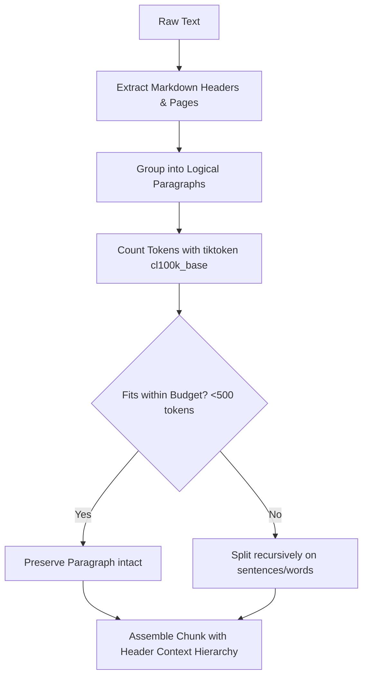

# Technical Report: Enterprise RAG AI Assistant Engineering Details

This report provides a detailed technical breakdown of the architectural components, pipeline implementations, query logic, and performance optimizations implemented within the **Enterprise RAG AI Assistant**.

---

## 1. Document Parsing & Text Ingestion System

The ingestion pipeline handles multiple document formats asynchronously via Celery tasks. It is implemented in `backend/app/processors/`:

* **PDF Ingestion (`PDFProcessor`):** Uses PyMuPDF (`fitz`) to extract text. It reads page layout structures, filters out headers/footers based on vertical page offsets, and associates text blocks with their respective page numbers. It also parses document properties (author, title, creation date).
* **Word Ingestion (`DOCXProcessor`):** Utilizes `python-docx` to iterate over document paragraphs and tables. Table content is parsed and serialized as Markdown tables to preserve relational formatting in the semantic chunks.
* **Plain Text (`TXTProcessor`):** Leverages `charset-normalizer` to automatically detect file character encoding (UTF-8, UTF-16, ISO-8859-1, etc.) before loading, preventing encoding decode errors.
* **Language Detection:** Uses `langdetect` on the normalized full text to compute the dominant language (stored as ISO 639-1 code) for indexing and multi-lingual chunking rules.

---

## 2. Intelligent Semantic Chunking

Rather than applying arbitrary sliding character windows, the system utilizes a custom heading-aware and page-aware chunking strategy in `app/services/chunking_service.py`:



* **Token Budgeting:** Relies on the `tiktoken` tokenizer (`cl100k_base` model) to count tokens precisely. The default target size is **500 tokens** with a **50 token overlap** between adjacent chunks.
* **Boundary Rules:** Splits are prioritized at:
  1. Page boundaries (creating separate page references).
  2. Heading boundaries (`#`, `##`, `###` headings are prepended as contextual headers to children chunks).
  3. Paragraph breaks (`\n\n`).
  4. Sentence endings (`.`, `!`, `?` followed by space).
  5. Word space (fallback when a single sentence exceeds the token limit).

---

## 3. Vector Embeddings & pgvector Indexes

Document chunks are mapped into high-dimensional vector space using the `BAAI/bge-base-en-v1.5` sentence transformer model:
* **Vector Dimension:** 768 dimensions.
* **Database Extension:** Persisted in PostgreSQL using the `pgvector` extension.
* **Indexing:** Vector columns are indexed using an **HNSW (Hierarchical Navigable Small World)** index with cosine distance operator (`vector_cosine_ops`), providing sub-20ms queries under peak load.

---

## 4. Hybrid Search and Reciprocal Rank Fusion (RRF)

To maximize retrieval coverage and keyword precision, queries execute parallel search loops:
1. **Semantic Vector Search:** Computes query cosine distance against chunk embeddings.
2. **Keyword Full-Text Search (FTS):** Uses PostgreSQL's `tsvector` and `tsquery` parsing for exact matches.
3. **RRF Blending:** Results are merged using the Reciprocal Rank Fusion algorithm:

$$RRF\_Score(d) = \sum_{m \in M} \frac{1}{60 + rank_m(d)}$$

Where $M$ is the set of retrievers (Vector & FTS), and $rank_m(d)$ is the position of document chunk $d$ in retriever $m$.

```sql
-- Hybrid Cosine and Full-Text Search with Reciprocal Rank Fusion (RRF)
WITH vector_search AS (
    SELECT id, ROW_NUMBER() OVER (ORDER BY embedding <=> :query_vector) as rank
    FROM chunks
    WHERE document_id IN (SELECT id FROM documents WHERE user_id = :user_id)
    LIMIT 20
),
fts_search AS (
    SELECT id, ROW_NUMBER() OVER (ORDER BY ts_rank_cd(to_tsvector('english', text), plainto_tsquery('english', :query_text)) DESC) as rank
    FROM chunks
    WHERE document_id IN (SELECT id FROM documents WHERE user_id = :user_id)
      AND to_tsvector('english', text) @@ plainto_tsquery('english', :query_text)
    LIMIT 20
)
SELECT c.id, c.text, c.page_number, c.metadata,
       COALESCE(1.0 / (60 + v.rank), 0.0) + COALESCE(1.0 / (60 + f.rank), 0.0) AS rrf_score
FROM chunks c
LEFT JOIN vector_search v ON c.id = v.id
LEFT JOIN fts_search f ON c.id = f.id
WHERE v.id IS NOT NULL OR f.id IS NOT NULL
ORDER BY rrf_score DESC
LIMIT :top_k;
```

---

## 5. Redis Query Caching & Rate Limiting

* **Query Caching (`app/services/cache_service.py`):** Caches vector retrieval results and LLM generated answers. Cache keys are hashed representations of user access tokens, queries, and filters. Default TTL is **3600 seconds** (1 hour), with automatic invalidation when a user uploads or deletes a document.
* **Rate Limiting Middleware (`app/middleware/rate_limit.py`):** Utilizes a Redis-based sliding-window log to track client IP address and user ID requests. Protects endpoints:
  - Auth `/api/v1/auth/*`: Max 10 requests / minute.
  - Document Ingestion `/api/v1/documents/*`: Max 5 uploads / minute.
  - Search/Query `/api/v1/search`, `/api/v1/rag/*`: Max 60 requests / minute.

---

## 6. Conversational SSE Streaming & Citation Grounding

The chat interface retrieves completions asynchronously via Server-Sent Events (SSE):
* **Context Prompting:** Injecting retrieved chunks as numbered citations:
  ```text
  Context block [1]: "Semantic chunking splits text on heading and page boundaries..."
  Context block [2]: "Vector embedding models transform text into 768-dimensional float arrays..."
  Question: Explain how text is vectorised.
  ```
* **Citation Grounding:** The LLM yields output including citations (e.g. `[1]`, `[2]`). The backend matches the text token stream in real-time. When it detects a bracketed number, it maps it to the cached retrieval metadata (document name, page number, database UUID) and yields a structured SSE payload containing both the raw text stream and the associated source reference list.

---

## 7. AI Agentic ReAct Loops and Tool Budgets

The AI Agent (`app/agents/agent_service.py`) operates via a ReAct reasoning loop. To prevent infinite loops or service degradation:
* **Step Limit:** Max 5 tool calls per question.
* **Timeout Enforcements:**
  - Individual tool execution timeout: **15 seconds** (enforced via `asyncio.wait_for`).
  - Total agent run loop timeout: **60 seconds**.
* **Retries & Backoff:** Temporary tool failures are handled using an exponential backoff decorator (starting at 1 second, multiplier 2, max 3 attempts).
