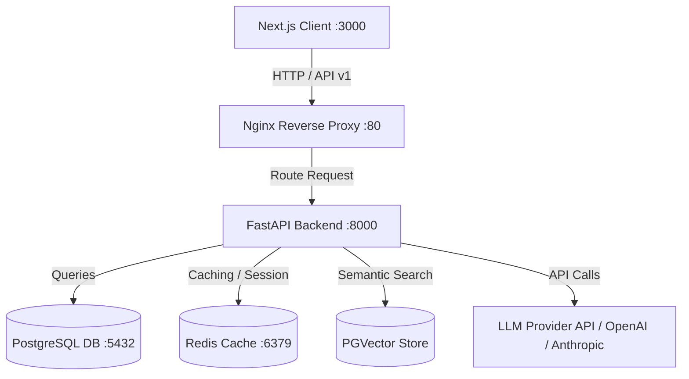
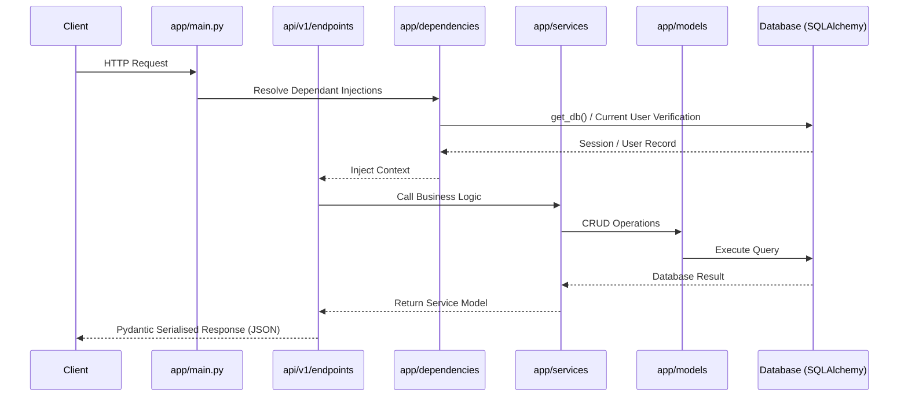
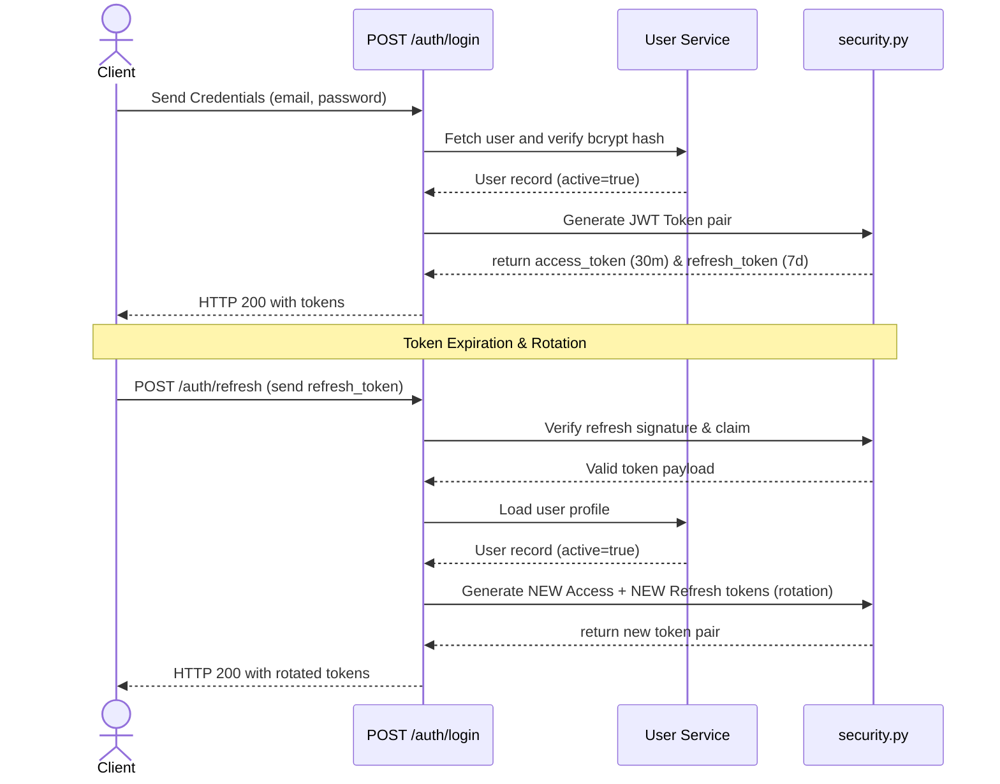
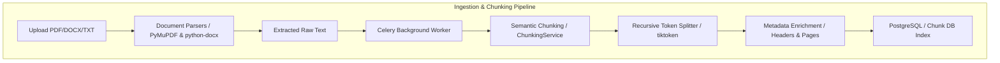
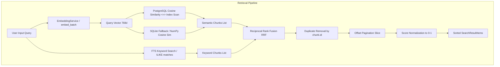
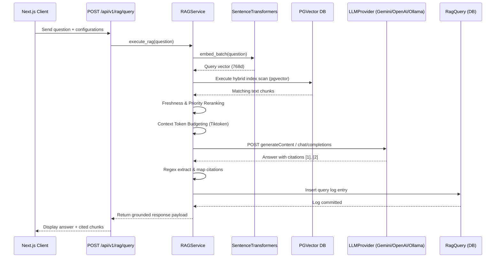
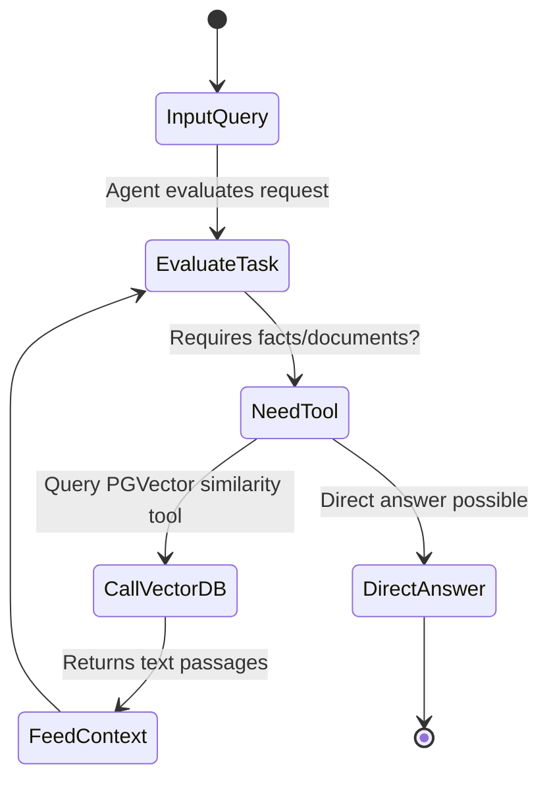
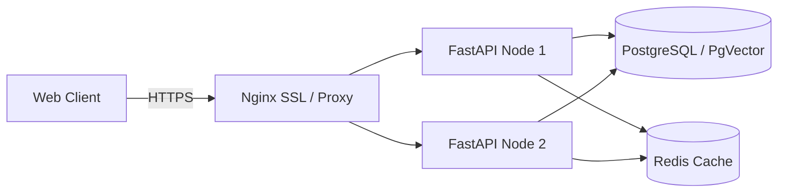

# Architectural Blueprint — Enterprise RAG AI Assistant

This document outlines the system architecture, authentication flows, data layers, and future engineering designs for the Enterprise RAG AI Assistant.

---

## 1. System Architecture

The application is structured as a decoupled, multi-tier system designed to support secure access and low-latency document processing:

---

## 2. Backend Architecture

The backend is built with FastAPI following a clean service-oriented architecture:

---

## 3. Frontend Architecture

The frontend uses Next.js 15 App Router, TypeScript, and Tailwind CSS.
- **Route Groups:** Auth views are grouped under `(auth)/` to share layout decorators and gradients.
- **API Client:** Centrally structured client (`lib/api.ts`) managing automatic bearer token injection and routing redirects to `/login` upon HTTP `401 Unauthorized` responses.
- **State Management:** Uses React 19 hooks and local state for modular form controls, relying on local storage cache configurations for JWT pairs.

---

## 4. Authentication Flow

Authentication is stateless and uses JWT (JSON Web Tokens) with a secure **Token Rotation** mechanism to mitigate token replay attacks:

---

## 5. Database Layer

- **SQLAlchemy 2.0 Async:** The database driver utilizes asynchronous connection factories (`async_sessionmaker[AsyncSession]`) to avoid blocking thread pools.
- **Native Types:** Restores native PostgreSQL types like `Uuid` and `Enum` for optimum index mapping, while abstracting fallbacks via SQLAlchemy column conversions on SQLite when executing tests.
- **Lifespan Integration:** Connection engine pool initialization is verified on startup and fully disposed on shutdown inside FastAPI's lifespan configuration.

---

## 6. Service Layer

The service layer contains the pure functional computations and CRUD queries of the system.
- **Separation of Concerns:** Route handlers are lightweight and perform request deserialization, dependency resolution, and response styling.
- **Transaction boundary:** Services flush data to the database session but do **NOT** commit it. Database session transactions are managed by the session generator middleware (`get_db`) to guarantee rollback safety across the request lifecycle.

---

## 7. Document Ingestion, Extraction & Semantic Chunking Pipeline

- **Document Ingestion:** Documents are securely uploaded, metadata (original filename, sha256_hash, mime_type, file_size) saved, and stored on persistent disk storage.
- **Asynchronous Pipeline:** Celery workers manage the text extraction and semantic chunking pipeline in the background using Redis task brokers.
- **Recursive Semantic Splitting:** Text chunks are created respecting a max token count using `tiktoken` to count tokens. The text is recursively split by page breaks (`\x0c`), Markdown headings, paragraphs, sentences, and words.
- **Enrichment & Context:** Chunks inherit global document properties, track their page numbers, section headers, and reading order indexes.

---

## 8. Semantic Retrieval Engine (Phase 8)

The Retrieval Engine processes queries, generates embeddings, queries the vector database, filters metadata, and ranks results.

### Key Components

- **Cosine Similarity Search**: PostgreSQL `pgvector` calculates distance using `<=>` operator (cosine distance). The similarity score is calculated as `1.0 - distance`.
- **HNSW Indexing**: Optimizes pgvector searches with Hierarchical Navigable Small World graphs using the `vector_cosine_ops` operator class, providing sub-millisecond query execution.
- **Reciprocal Rank Fusion (RRF)**: Merges semantic results and keyword results by score rankings using:
  $$RRF(d) = \sum_{m \in M} \frac{1}{k + r_m(d)}$$
  where $k = 60$ and $r_m(d)$ is the rank of document $d$ in system $m$.
- **Score Normalization**: Scales cosine similarities from range `[-1.0, 1.0]` to `[0.0, 1.0]` using `(score + 1.0) / 2.0`, providing a clean threshold pruning range for users.
- **Offset Pagination**: Optimized database scan using `.offset(offset).limit(top_k)` on PostgreSQL, and in-memory slicing on combined hybrid results.
- **Batch Retrieval**: Evaluates a list of input queries concurrently or sequentially to support advanced multi-hop queries.

### Performance Considerations
- **Index Scans**: Native HNSW indices in PostgreSQL ensure that search query scaling is $O(\log N)$ rather than $O(N)$ sequential table scans.
- **Deduplication**: Filters duplicate chunks at retrieval time, optimizing network overhead and context window limits.

---

---

## 9. Enterprise Retrieval-Augmented Generation Pipeline (Phase 9)

The RAG Pipeline aggregates semantic retrieval, custom reranking, token context assembly, and LLM text generation to deliver fully grounded answers with citations.

### Request Flow & Sequence

### Provider Abstraction Interface

The system decouples the LLM provider from the service execution layers via an abstract base class `LLMProvider`. Concrete providers utilize direct HTTP calls to avoid heavy library dependency chains:
- **Google Gemini**: Hits `/models/gemini-1.5-flash:generateContent` using structured systemInstruction.
- **OpenAI**: Hits chat completions `/v1/chat/completions` using system role messages.
- **Local/Ollama**: Hits local endpoint `/chat/completions` via local model hosts.

### Prompt Engineering Strategy

Prompt templates enforce grounding and citation mapping:
1. **Context Passages Formatting**: Context chunks are appended with unique numeric indices:
   `--- Chunk [1] --- Document: proposal.pdf Page: 3 Content: ...`
2. **System Prompt Directives**: Instructs the model:
   - Answer **ONLY** using the supplied context passages.
   - If information is missing, clearly state that. Do not hallucinate or guess.
   - Append citation brackets `[index]` (e.g. `[1]`) at the end of sentences that use facts from that chunk.

### Citation Pipeline

1. **Generation**: The LLM outputs citation tags like `[1]` in its response.
2. **Extraction**: The RAG service executes a regular expression `\[(\d+)\]` on the response text.
3. **Lookup**: Parsed indices are mapped back to the active chunks list to extract document title, page number, section title, and raw text segment.
4. **Tooltips/Highlights**: The Next.js client renders citation tags as interactive UI badges. Clicking a badge highlights and scrolls to the source document chunk reference.

### Deployment & Environment Requirements

Configure the following variables in the deployment environment:
- `LLM_PROVIDER`: `gemini` (default), `openai`, or `ollama`.
- `GEMINI_API_KEY`: API Key for Google Gemini API.
- `OPENAI_API_KEY`: API Key for OpenAI completions.
- `RAG_TOP_K`: Number of context chunks to pull (default: `5`).
- `RAG_MAX_CONTEXT_TOKENS`: Tiktoken count limit (default: `4000`).
- `RAG_TEMPERATURE`: LLM generation randomness (default: `0.2`).
- `RAG_MAX_OUTPUT_TOKENS`: Max generated tokens (default: `1000`).

---

## 10. Future AI Agent Architecture (Phase 10)

For complex searches, the system will leverage a tool-calling AI agent loop:

---

## 11. Deployment Architecture

For scaling, Nginx load balances traffic across multiple stateless Docker backend nodes:

