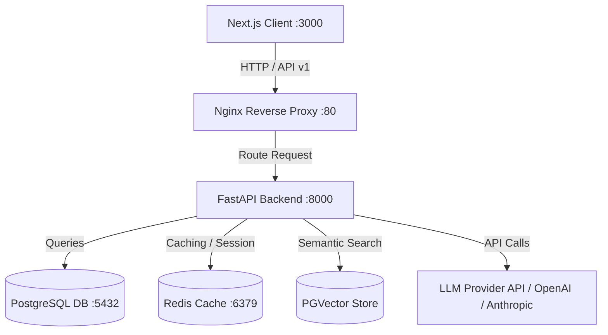
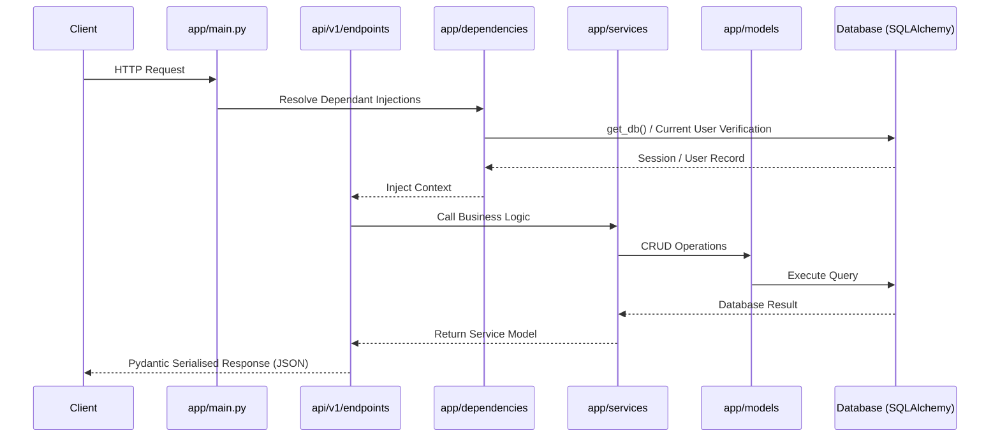
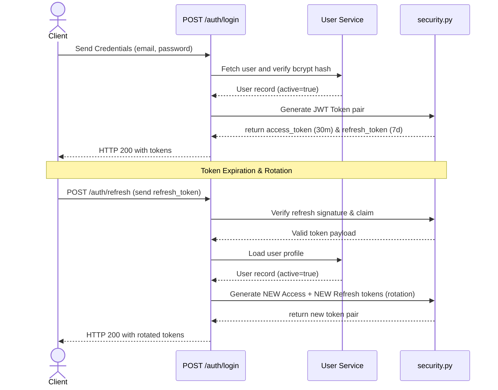
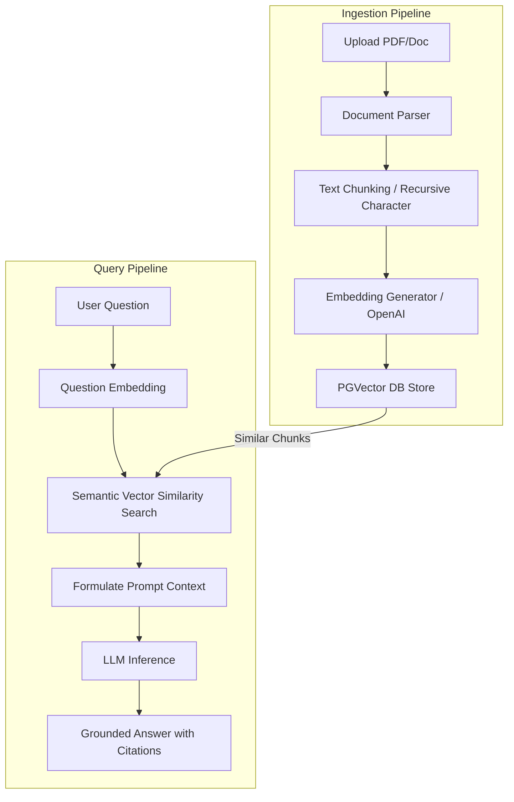
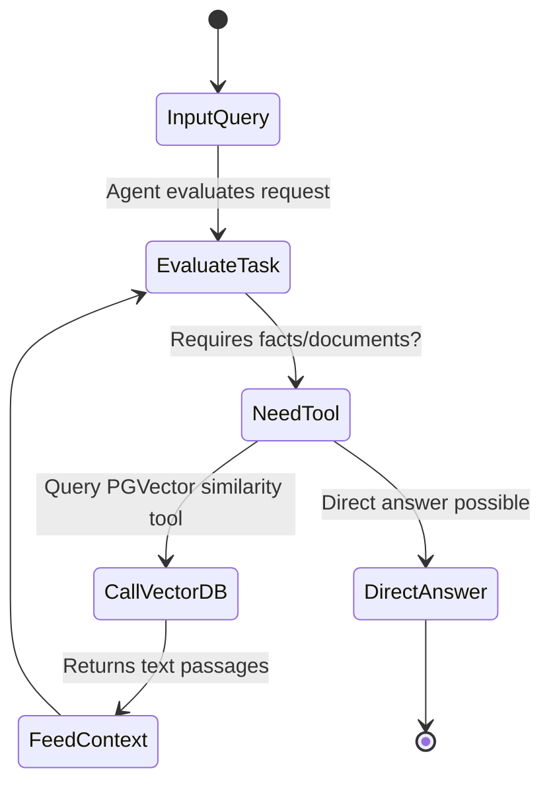
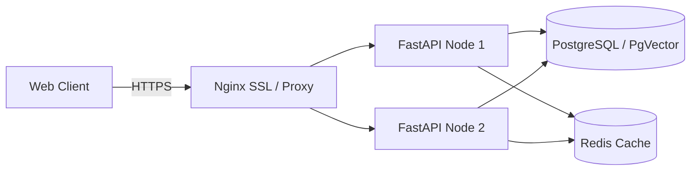

# Architectural Blueprint — Enterprise RAG AI Assistant

This document outlines the system architecture, authentication flows, data layers, and future engineering designs for the Enterprise RAG AI Assistant.

---

## 1. System Architecture

The application is structured as a decoupled, multi-tier system designed to support secure access and low-latency document processing:

---

## 2. Backend Architecture

The backend is built with FastAPI following a clean service-oriented architecture:

---

## 3. Frontend Architecture

The frontend uses Next.js 15 App Router, TypeScript, and Tailwind CSS.
- **Route Groups:** Auth views are grouped under `(auth)/` to share layout decorators and gradients.
- **API Client:** Centrally structured client (`lib/api.ts`) managing automatic bearer token injection and routing redirects to `/login` upon HTTP `401 Unauthorized` responses.
- **State Management:** Uses React 19 hooks and local state for modular form controls, relying on local storage cache configurations for JWT pairs.

---

## 4. Authentication Flow

Authentication is stateless and uses JWT (JSON Web Tokens) with a secure **Token Rotation** mechanism to mitigate token replay attacks:

---

## 5. Database Layer

- **SQLAlchemy 2.0 Async:** The database driver utilizes asynchronous connection factories (`async_sessionmaker[AsyncSession]`) to avoid blocking thread pools.
- **Native Types:** Restores native PostgreSQL types like `Uuid` and `Enum` for optimum index mapping, while abstracting fallbacks via SQLAlchemy column conversions on SQLite when executing tests.
- **Lifespan Integration:** Connection engine pool initialization is verified on startup and fully disposed on shutdown inside FastAPI's lifespan configuration.

---

## 6. Service Layer

The service layer contains the pure functional computations and CRUD queries of the system.
- **Separation of Concerns:** Route handlers are lightweight and perform request deserialization, dependency resolution, and response styling.
- **Transaction boundary:** Services flush data to the database session but do **NOT** commit it. Database session transactions are managed by the session generator middleware (`get_db`) to guarantee rollback safety across the request lifecycle.

---

## 7. Future RAG Ingestion & Query Pipeline (Phase 4)

---

## 8. Future AI Agent Architecture (Phase 4+)

For complex searches, the system will leverage a tool-calling AI agent loop:

---

## 9. Deployment Architecture

For scaling, Nginx load balances traffic across multiple stateless Docker backend nodes:

